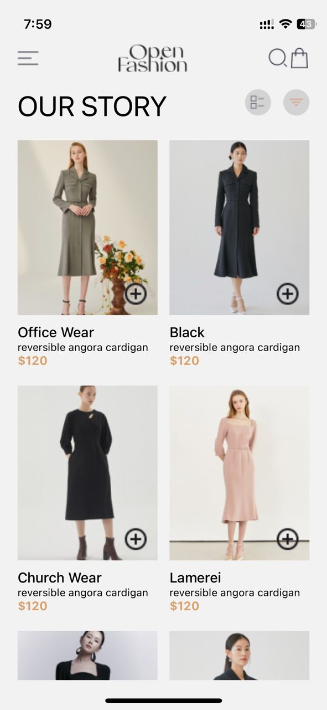
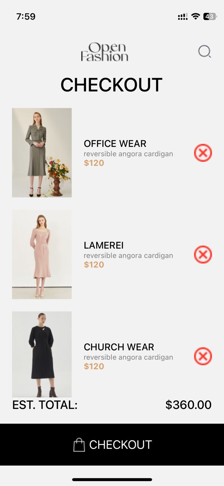

# rn-assignment6-11259806# rn-assignment5-11259806

# Homepage

# Checkout Page

# Description of task
The OpenFashion app is an app where users can browse clothing products
and make purchases.

In the App.js, the cart state is managed and rendered in both the Homepage and Checkoutpage.

The HomePage component fetches the cart data from AsyncStorage when it mounts and updates the state. It renders a list of items and allows users to add items to the cart.

The Checkout component displays the items in the cart, calculates the total price, and allows users to remove items from the cart. It also updates the cart data in AsyncStorage whenever items are added or removed.
